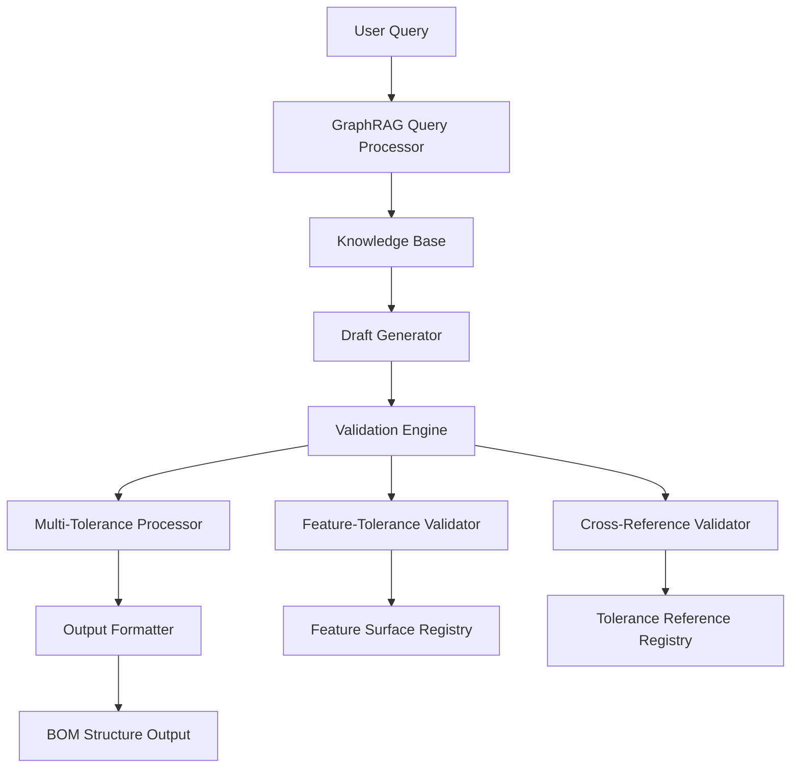

# Design Document: GDT Validation Enhancement

## Overview

This design document outlines the enhancement of the GDT (Geometric Dimensioning and Tolerancing) validation system to address two critical issues:

1. **Validation Mechanism Enhancement**: Implement pre-output validation to ensure worm gear reference tolerances correctly correspond to their target feature surfaces
2. **Multi-Tolerance Display Enhancement**: Enable complete display of all reference tolerances when a single feature surface has multiple tolerance associations

The enhancement builds upon the existing GraphRAG-based system that processes tolerance networks and generates BOM (Bill of Materials) structures with tolerance relationships.

### Current System Context

The existing system uses:
- **GraphRAG**: Knowledge graph-based retrieval for tolerance relationships
- **BOM Structure**: Hierarchical representation of parts and features with tolerance annotations
- **Tolerance Format**: Individual tolerances `(tolerance_name)` and cross-reference tolerances `[tolerance_name]`
- **Feature Naming**: Pattern `{part_id}-{type}-{number}` (e.g., `3-P-1`, `3-S-1`, `3-H-1`)

## Architecture

### System Components



### Enhanced Validation Pipeline

The validation enhancement introduces a two-stage validation process:

1. **Pre-Validation Stage**: Validates feature-tolerance mappings before output generation
2. **Multi-Tolerance Aggregation**: Collects and displays all tolerance references for each feature

## Components and Interfaces

### 1. Validation Engine

**Purpose**: Core validation logic for tolerance-feature relationships

**Interface**:
```python
class ValidationEngine:
    def validate_tolerance_mappings(self, bom_structure: BOMStructure) -> ValidationResult
    def validate_cross_references(self, tolerance_refs: List[ToleranceReference]) -> ValidationResult
    def aggregate_multi_tolerances(self, feature_id: str) -> List[ToleranceReference]
```

### 2. Feature Surface Registry

**Purpose**: Maintains registry of all valid feature surfaces and their properties

**Interface**:
```python
class FeatureSurfaceRegistry:
    def register_feature(self, part_id: str, feature_id: str, feature_type: str) -> None
    def is_valid_feature(self, feature_id: str) -> bool
    def get_feature_part(self, feature_id: str) -> str
    def get_features_by_part(self, part_id: str) -> List[str]
```

### 3. Tolerance Reference Registry

**Purpose**: Tracks tolerance references and their target features

**Interface**:
```python
class ToleranceReferenceRegistry:
    def add_tolerance_reference(self, tolerance_id: str, source_feature: str, target_feature: str) -> None
    def get_tolerance_references(self, feature_id: str) -> List[ToleranceReference]
    def validate_reference_exists(self, tolerance_id: str, target_feature: str) -> bool
```

### 4. Multi-Tolerance Processor

**Purpose**: Handles aggregation and display of multiple tolerances per feature

**Interface**:
```python
class MultiToleranceProcessor:
    def collect_all_tolerances(self, feature_id: str) -> ToleranceCollection
    def format_tolerance_display(self, tolerances: ToleranceCollection) -> str
    def merge_tolerance_types(self, individual: List[str], cross_ref: List[str]) -> str
```

## Data Models

### BOM Structure Model

```python
@dataclass
class FeatureSurface:
    feature_id: str          # e.g., "3-P-1"
    part_id: str            # e.g., "3"
    feature_type: str       # "P", "S", "H"
    feature_number: int     # 1, 2, etc.
    individual_tolerances: List[str]  # e.g., ["3-Dia-1", "3-Cir-1"]
    cross_reference_tolerances: List[str]  # e.g., ["3-Dis-1", "3-Per-1"]

@dataclass
class Part:
    part_id: str           # e.g., "3"
    part_name: str         # e.g., "蝸輪"
    features: List[FeatureSurface]

@dataclass
class BOMStructure:
    assembly_name: str     # e.g., "精密迴轉滑台"
    parts: List[Part]
```

### Validation Models

```python
@dataclass
class ValidationError:
    error_type: str        # "INVALID_REFERENCE", "MISSING_FEATURE", "SELF_REFERENCE"
    feature_id: str
    tolerance_id: str
    description: str

@dataclass
class ValidationResult:
    is_valid: bool
    errors: List[ValidationError]
    warnings: List[str]

@dataclass
class ToleranceReference:
    tolerance_id: str      # e.g., "3-Dis-1"
    reference_type: str    # "INDIVIDUAL" or "CROSS_REFERENCE"
    source_feature: str    # Feature that has this tolerance
    target_feature: str    # Feature this tolerance references (for cross-ref)
```

### Enhanced Output Format

The enhanced system will produce output in this format:

```
3-P-1 [3-Dis-1, 3-Per-1]
3-P-2 [3-Dis-1, 3-Per-2]  
3-S-1 (3-Dia-1) [3-Con-1]
3-H-1 (3-Cir-1, 3-Dia-1, 3-Dia-2) [3-Per-1, 3-Per-2]
```

Where:
- `(tolerance_name)`: Individual/geometric tolerances applied to the feature
- `[tolerance_name]`: Cross-reference tolerances that reference this feature
- Multiple tolerances are comma-separated within their respective brackets
## Correctness Properties

*A property is a characteristic or behavior that should hold true across all valid executions of a system-essentially, a formal statement about what the system should do. Properties serve as the bridge between human-readable specifications and machine-verifiable correctness guarantees.*

Now I need to analyze the acceptance criteria from the requirements to create correctness properties. Let me use the prework tool to analyze the testability of each requirement.

### Property 1: Cross-Reference Validation

*For any* BOM structure with tolerance references, when the validation engine processes the structure, all cross-reference tolerances should only point to feature surfaces that exist within the same part, and any invalid references should be removed from the output.

**Validates: Requirements 1.1, 1.2**

### Property 2: Self-Reference Elimination

*For any* tolerance reference that points to the same feature surface it originates from, the validation engine should remove the self-reference and continue processing the remaining valid references.

**Validates: Requirements 1.3**

### Property 3: Multi-Tolerance Formatting

*For any* feature surface with tolerance associations, the system should format individual tolerances in parentheses and cross-reference tolerances in square brackets, with multiple tolerances of the same type comma-separated, and individual tolerances appearing before cross-reference tolerances when both types are present.

**Validates: Requirements 2.1, 2.2, 2.3**

## Error Handling

### Validation Error Types

The system handles several categories of validation errors:

1. **Invalid Reference Errors**: When a tolerance references a non-existent feature
2. **Self-Reference Errors**: When a tolerance references its own source feature  
3. **Part Boundary Errors**: When a tolerance references a feature in a different part
4. **Format Errors**: When tolerance identifiers don't follow the expected naming convention

### Error Recovery Strategy

- **Graceful Degradation**: Remove invalid references while preserving valid ones
- **Logging**: Record all validation errors for debugging and system monitoring
- **User Feedback**: Provide clear error messages when validation issues are detected
- **Continuation**: Process remaining valid tolerances even when some are invalid

### Error Logging Format

```python
ValidationError(
    error_type="INVALID_REFERENCE",
    feature_id="3-P-1", 
    tolerance_id="3-Dis-5",
    description="Tolerance 3-Dis-5 references non-existent feature 3-P-5"
)
```

## Testing Strategy

### Dual Testing Approach

The system requires both unit testing and property-based testing for comprehensive validation:

**Unit Tests** focus on:
- Specific examples of known tolerance configurations
- Edge cases like empty BOM structures or malformed tolerance IDs
- Integration between validation components
- Error logging and recovery mechanisms

**Property-Based Tests** focus on:
- Universal validation rules across all possible BOM structures
- Tolerance formatting consistency for any combination of tolerance types
- Validation behavior with randomly generated tolerance references
- System behavior under various invalid reference scenarios

### Property-Based Testing Configuration

- **Testing Library**: Use Hypothesis for Python property-based testing
- **Test Iterations**: Minimum 100 iterations per property test
- **Test Tagging**: Each property test references its design document property

**Tag Format Examples**:
- `# Feature: gdt-validation-enhancement, Property 1: Cross-Reference Validation`
- `# Feature: gdt-validation-enhancement, Property 2: Self-Reference Elimination`  
- `# Feature: gdt-validation-enhancement, Property 3: Multi-Tolerance Formatting`

### Test Data Generation

Property tests will generate:
- **Random BOM Structures**: Parts with varying numbers of features and tolerance types
- **Invalid References**: Tolerance IDs that don't correspond to existing features
- **Self-References**: Tolerances that reference their own source features
- **Mixed Tolerance Types**: Features with combinations of individual and cross-reference tolerances
- **Edge Cases**: Empty tolerance lists, malformed IDs, boundary conditions

### Unit Test Coverage

Unit tests will cover:
- Validation of specific known tolerance configurations from the worm gear system
- Error handling for each validation error type
- Correct formatting of the expected output examples (3-P-1, 3-S-1, 3-H-1 cases)
- Integration between ValidationEngine, FeatureSurfaceRegistry, and ToleranceReferenceRegistry
- Performance benchmarks for typical BOM structure sizes